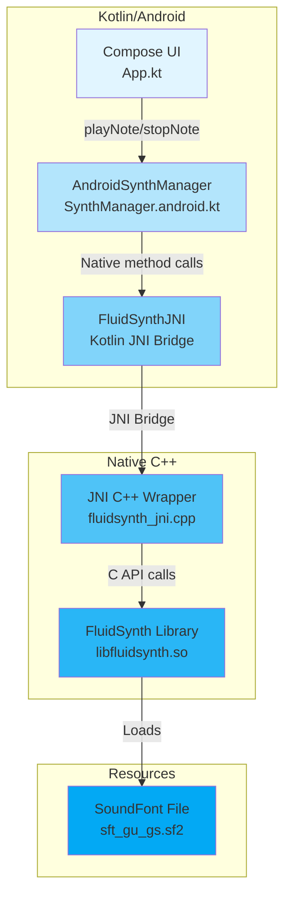

# Android FluidSynth Integration

This directory contains the Android-specific implementation of FluidSynth integration using JNI (Java Native Interface).

## Architecture Overview



## Key Components

### 1. **AndroidSynthManager** (`SynthManager.android.kt`)
- Platform-specific implementation of `SynthManager` interface
- Manages lifecycle of FluidSynth synthesizer
- Handles audio initialization and cleanup
- Bridges Kotlin UI layer to native code

### 2. **FluidSynthJNI** (`FluidSynthJNI.kt`)
- Kotlin declarations for native methods
- Provides type-safe API for C++ functions
- Methods include:
  - `createSynth()` - Initialize synthesizer
  - `loadSoundFont()` - Load SF2 file
  - `noteOn()` / `noteOff()` - Trigger MIDI events
  - `programChange()` - Change instrument
  - `setMasterGain()` - Volume control

### 3. **Native C++ Wrapper** (`cpp/fluidsynth_jni.cpp`)
- JNI implementation bridging Java/Kotlin to C
- Manages FluidSynth C API calls
- Handles memory management and error handling
- Audio rendering integration with Android audio system

### 4. **FluidSynth Library**
- Open-source software synthesizer
- Renders MIDI events to audio samples
- Supports SoundFont 2.x format
- Compiled as native library (`libfluidsynth.so`)

## Data Flow

### Initialization
1. User launches app → Compose UI renders
2. `AndroidSynthManager.initialize()` called
3. Creates native synthesizer via JNI
4. Loads SoundFont file from assets
5. Initializes audio output

### Note Playback
1. User taps piano key in UI
2. `playNote(note, velocity)` called on `AndroidSynthManager`
3. JNI bridge forwards to C++ wrapper
4. C++ calls FluidSynth API: `fluid_synth_noteon()`
5. FluidSynth renders audio samples
6. Audio samples sent to Android audio output

## File Structure

```
androidMain/
├── kotlin/org/tetawex/cmpsftdemo/
│   ├── SynthManager.android.kt    # Android implementation
│   └── FluidSynthJNI.kt           # JNI bridge interface
├── cpp/
│   └── fluidsynth_jni.cpp         # Native JNI implementation
└── res/
    └── raw/
        └── sft_gu_gs.sf2          # SoundFont file
```

## Building

The native library is automatically compiled during the Android build process using CMake (configured in `build.gradle.kts`).

## Technical Notes

- **Thread Safety**: JNI calls are thread-safe; FluidSynth handles concurrent access
- **Memory Management**: Native handles managed explicitly; cleanup in `destroy()`
- **Audio Latency**: Uses Android's native audio system for low-latency playback
- **SoundFont Format**: SF2 format (SoundFont 2.x) required
