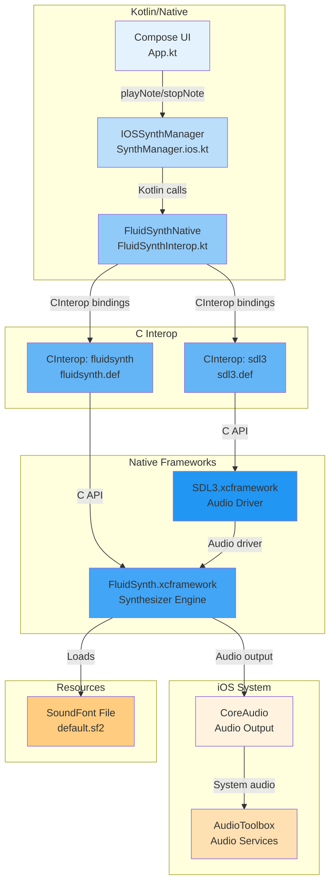
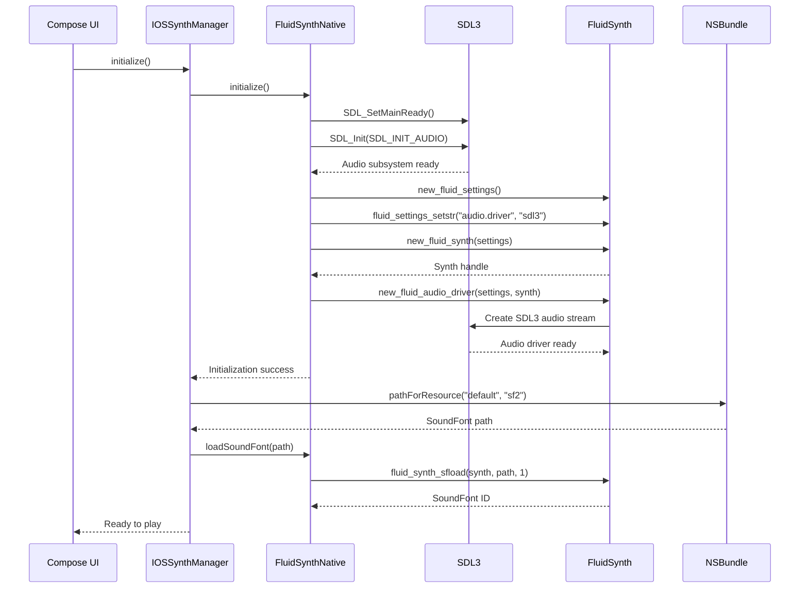
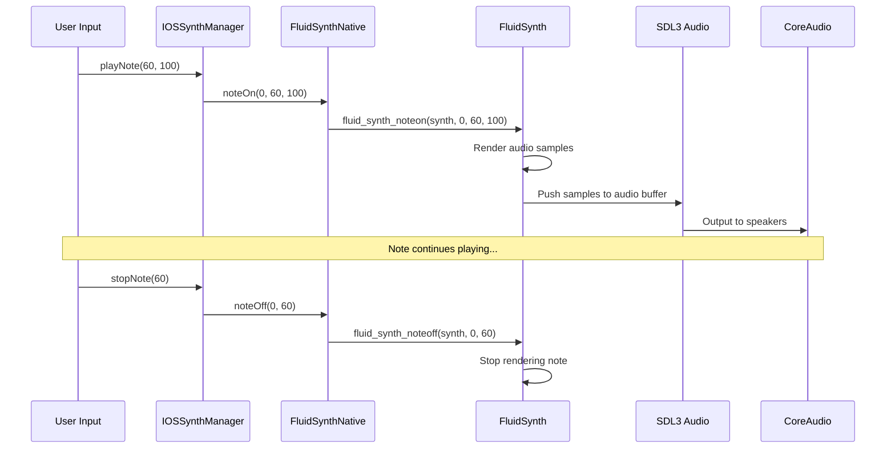

# iOS FluidSynth Integration

This directory contains the iOS-specific implementation of FluidSynth integration using Kotlin/Native C Interop with prebuilt xcframeworks.

## Architecture Overview



## Key Components

### 1. **IOSSynthManager** (`SynthManager.ios.kt`)
- Platform-specific implementation of `SynthManager` interface
- Manages lifecycle of FluidSynth synthesizer
- Loads SoundFont from iOS app bundle via `NSBundle`
- Bridges Compose UI layer to native FluidSynth wrapper

### 2. **FluidSynthNative** (`FluidSynthInterop.kt`)
- Kotlin/Native wrapper around FluidSynth C API
- Uses `@OptIn(ExperimentalForeignApi::class)` for C interop
- Manages SDL3 audio subsystem initialization
- Methods include:
  - `initialize()` - Initialize SDL3 and FluidSynth
  - `loadSoundFont()` - Load SF2 file from path
  - `noteOn()` / `noteOff()` - Trigger MIDI events
  - `programChange()` - Change instrument
  - `setGain()` - Volume control
  - `setBufferSize()` - Configure audio latency
  - `cleanup()` - Release all resources

### 3. **C Interop Definitions**
- **`fluidsynth.def`**: Binds FluidSynth C API to Kotlin
- **`sdl3.def`**: Binds SDL3 audio API to Kotlin
- Generated Kotlin bindings provide type-safe access to C functions
- Uses `-DSDL_MAIN_HANDLED` to bypass SDL's main() handling

### 4. **Native Frameworks**
- **FluidSynth.xcframework**: Prebuilt FluidSynth synthesizer library
- **SDL3.xcframework**: SDL3 audio driver for cross-platform audio output
- Both support `ios-arm64` (device) and `ios-arm64_x86_64-simulator`

## Data Flow

### Initialization Sequence



### Note Playback Flow



## File Structure

```
iosMain/
├── kotlin/org/tetawex/cmpsftdemo/
│   ├── SynthManager.ios.kt      # iOS SynthManager implementation
│   ├── FluidSynthInterop.kt     # Kotlin wrapper for FluidSynth C API
│   ├── Platform.ios.kt          # Platform utilities
│   └── MainViewController.kt    # iOS view controller
└── interop/
    ├── fluidsynth.def           # CInterop definition for FluidSynth
    └── sdl3.def                 # CInterop definition for SDL3

composeApp/frameworks/           # XCFrameworks (copied from distribution)
├── FluidSynth.xcframework/
│   ├── ios-arm64/               # Device build
│   └── ios-arm64_x86_64-simulator/  # Simulator build
└── SDL3.xcframework/
    ├── ios-arm64/
    └── ios-arm64_x86_64-simulator/

iosApp/iosApp/Resources/
└── default.sf2                  # SoundFont file (in app bundle)
```

## Build Configuration

### Gradle Configuration (`build.gradle.kts`)
```kotlin
listOf(iosArm64(), iosSimulatorArm64()).forEach { iosTarget ->
    iosTarget.binaries.framework {
        linkerOpts += "-F$fluidSynthFwPath"
        linkerOpts += "-F$sdl3FwPath"
        linkerOpts += "-framework FluidSynth"
        linkerOpts += "-framework SDL3"
    }
    
    iosTarget.compilations.getByName("main") {
        cinterops {
            val fluidsynth by creating {
                defFile = project.file("src/iosMain/interop/fluidsynth.def")
                packageName = "org.tetawex.cmpsftdemo.fluidsynth"
            }
            val sdl3 by creating {
                defFile = project.file("src/iosMain/interop/sdl3.def")
                packageName = "org.tetawex.cmpsftdemo.sdl3"
            }
        }
    }
}
```

### Xcode Configuration
1. Add `FluidSynth.xcframework` and `SDL3.xcframework` to project
2. Set **Embed** to **"Embed & Sign"** for both frameworks
3. Add `default.sf2` to app bundle resources

## Technical Details

### Kotlin/Native C Interop
- **CInterop**: Generates Kotlin bindings from C headers
- **CPointer**: Opaque pointer type for C struct handles
- **ExperimentalForeignApi**: Required annotation for C interop
- **Memory Management**: Manual cleanup via `delete_*` functions

### SDL3 Audio Integration
- **SDL_SetMainReady()**: Tells SDL we're handling main() ourselves
- **SDL_Init(SDL_INIT_AUDIO)**: Initialize audio subsystem only
- **Audio Driver**: FluidSynth uses SDL3 as audio backend via `audio.driver=sdl3`

### FluidSynth Settings
| Setting | Value | Description |
|---------|-------|-------------|
| `audio.driver` | `sdl3` | Use SDL3 audio driver |
| `synth.polyphony` | `256` | Maximum simultaneous voices |
| `synth.midi-channels` | `16` | Standard MIDI channels |
| `synth.gain` | `0.8` | Master volume (0.0-1.0) |
| `audio.period-size` | `512` | Buffer size (samples) |

### iOS-Specific Considerations
- **App Bundle**: SoundFont loaded from `NSBundle.mainBundle`
- **Framework Signing**: XCFrameworks must be signed ("Embed & Sign")
- **Background Audio**: Configure audio session for background playback if needed
- **Memory**: ~15-20MB for FluidSynth + SoundFont

## Debugging

Common issues:

| Issue | Solution |
|-------|----------|
| "SDL3 not initialized" | Ensure `SDL_SetMainReady()` called before `SDL_Init()` |
| "FluidSynth framework not found" | Check Framework Search Paths in Xcode |
| "Library not loaded" | Set framework Embed to "Embed & Sign" |
| "Unsigned library" | Framework must be code signed |
| "Soundfont not found" | Add .sf2 file to Xcode project resources |
| No sound | Check device volume, audio session category |

Enable logging via `NSLog()` statements in Kotlin code.

## Running

### From Xcode
1. Open `iosApp/iosApp.xcodeproj`
2. Select target device/simulator
3. Build and run (⌘R)
