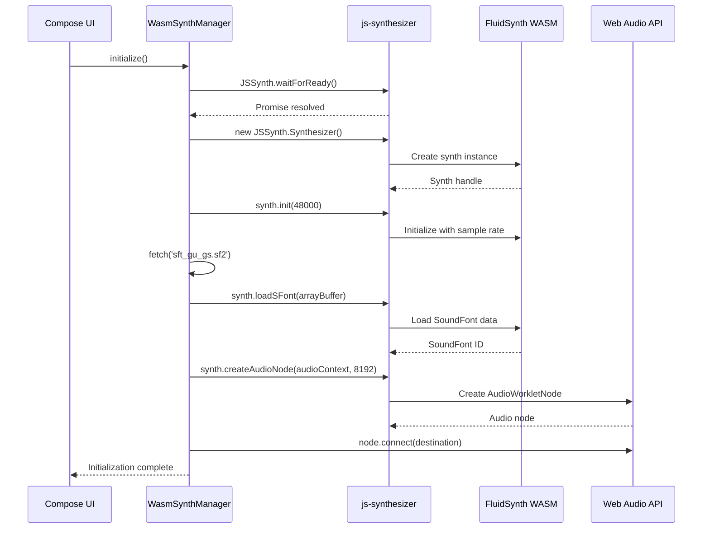
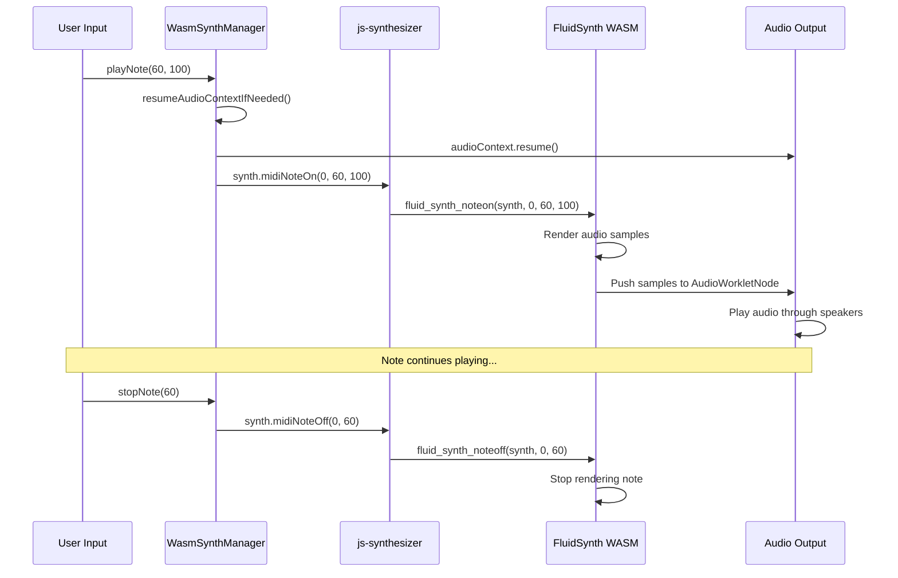

# WASM FluidSynth Integration

This directory contains the WASM-specific implementation of FluidSynth integration using Emscripten and js-synthesizer.

## Architecture Overview

```mermaid
graph TB
    subgraph "Kotlin/WASM"
        UI[Compose UI<br/>App.kt]
        WSM[WasmSynthManager<br/>SynthManager.wasmJs.kt]
        EXT[External Declarations<br/>Synthesizer class]
    end
    
    subgraph "JavaScript Bridge"
        JSS[js-synthesizer.min.js<br/>High-level API]
        JSSYN[JSSynth.Synthesizer]
    end
    
    subgraph "WebAssembly"
        EMFS[libfluidsynth WASM<br/>Emscripten build]
        FSC[FluidSynth C Code<br/>Compiled to WASM]
    end
    
    subgraph "Browser APIs"
        WAA[Web Audio API<br/>AudioContext]
        AWN[AudioWorkletNode<br/>Audio Processing]
    end
    
    subgraph "Resources"
        SF[SoundFont File<br/>sft_gu_gs.sf2]
    end
    
    UI -->|playNote/stopNote| WSM
    WSM -->|External function calls| EXT
    EXT -->|js() interop| JSS
    JSS -->|API wrapper| JSSYN
    JSSYN -->|ccall/cwrap| EMFS
    EMFS -->|WASM execution| FSC
    WSM -->|createAudioNode| WAA
    WAA -->|Audio output| AWN
    FSC -->|Renders samples| AWN
    EMFS -->|fetch + loadSFont| SF
    
    style UI fill:#e8f5e9
    style WSM fill:#c8e6c9
    style EXT fill:#a5d6a7
    style JSS fill:#81c784
    style JSSYN fill:#66bb6a
    style EMFS fill:#4caf50
    style FSC fill:#43a047
    style WAA fill:#fce4ec
    style AWN fill:#f8bbd0
    style SF fill:#f48fb1
```

## Key Components

### 1. **WasmSynthManager** (`SynthManager.wasmJs.kt`)
- Platform-specific implementation using Kotlin/WASM
- Uses `@OptIn(ExperimentalWasmJsInterop::class)` for JS interop
- Manages synthesizer lifecycle in browser environment
- Handles browser autoplay policy (audio context suspension)

### 2. **External Declarations**
- Kotlin declarations for JavaScript objects
- `Synthesizer` class maps to `JSSynth.Synthesizer`
- `AudioContext`, `AudioWorkletNode` for Web Audio API
- All `js()` calls must be in top-level functions

### 3. **js-synthesizer Library**
- High-level JavaScript wrapper for FluidSynth WASM
- Provides Promise-based async API
- Methods:
  - `init(sampleRate)` - Initialize synthesizer
  - `loadSFont(arrayBuffer)` - Load SoundFont from ArrayBuffer
  - `midiNoteOn/Off()` - MIDI event handling
  - `createAudioNode()` - Web Audio integration
  - `setGain()` - Volume control

### 4. **FluidSynth WASM Module**
- FluidSynth C library compiled to WebAssembly via Emscripten
- Includes libsndfile support for SF2 loading
- Runs in browser's WASM runtime
- Same synthesis engine as native platforms

### 5. **Web Audio API Integration**
- `AudioContext` manages audio processing graph
- `AudioWorkletNode` processes synthesized samples
- Handles browser-specific audio policies
- Low-latency audio output

## Data Flow

### Initialization Sequence



### Note Playback Flow



## File Structure

```
wasmJsMain/
├── kotlin/org/tetawex/cmpsftdemo/
│   └── SynthManager.wasmJs.kt       # WASM implementation
└── resources/
    ├── index.html                    # HTML entry point
    ├── js-synthesizer.min.js         # Wrapper library (v1.8.5)
    ├── libfluidsynth-2.4.6-with-libsndfile.js  # Emscripten output
    ├── libfluidsynth-2.4.6-with-libsndfile.wasm # WASM binary
    └── sft_gu_gs.sf2                 # SoundFont file
```

## Technical Details

### Kotlin/WASM JS Interop
- **External Declarations**: Map Kotlin types to JavaScript objects
- **Top-level `js()` calls**: Required for direct JavaScript execution
- **Promise Handling**: Custom `promiseToSuspend()` converts JS Promises to Kotlin coroutines
- **Type Bridging**: `JsAny` base type for JavaScript objects

### Browser Constraints
- **Autoplay Policy**: Audio context starts suspended; must resume on user gesture
- **CORS**: SoundFont and WASM files must be served from same origin
- **Memory**: WASM has dedicated heap; ArrayBuffer used for data transfer
- **Threading**: Single-threaded in main browser context

### Helper Functions
All `js()` calls must be top-level functions:
- `createSynthesizer()` - Instantiate JSSynth.Synthesizer
- `fetchArrayBuffer()` - Load files as ArrayBuffer
- `promiseThen()` - Promise callback wrapper
- `resumeAudioContextAsync()` - Non-blocking audio resume
- `getAudioContextState()` - Check audio context status

## Performance Considerations

- **Buffer Size**: 8192 samples balances latency and performance
- **Sample Rate**: 48kHz (browser default, matches most audio hardware)
- **WASM Overhead**: Near-native performance for audio synthesis
- **Memory Usage**: ~10MB for FluidSynth + SoundFont
- **Latency**: ~170ms total (buffer + processing + output)

## Debugging

Enable verbose console logging to trace initialization:
```kotlin
console.log("Step description")
```

Common issues:
- **"JSSynth is not defined"**: Scripts not loaded before Kotlin code
- **"promise.then is not a function"**: Incorrect Promise handling
- **"audioContext is suspended"**: User hasn't interacted with page
- **No sound**: Check browser audio permissions and volume

## Running

```bash
.\gradlew.bat :composeApp:wasmJsBrowserDevelopmentRun
```

Open http://localhost:8081/ in a modern browser (Chrome, Firefox, Safari, Edge).
